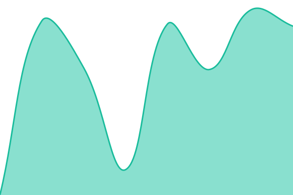
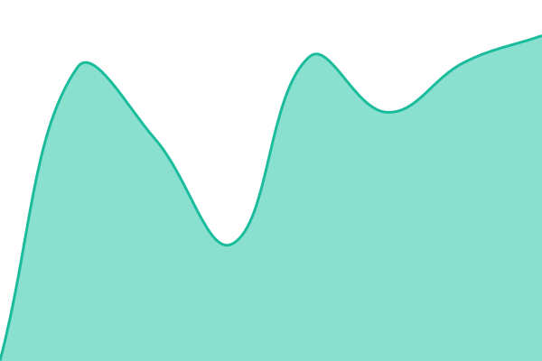

# [📈 Live Status](https://luratic-devs.github.io/upptime): <!--live status--> **🟩 All systems operational**

This repository contains the open-source uptime monitor and status page for [Luratic](https://www.luratic.com), powered by [Upptime](https://github.com/upptime/upptime).

With [Upptime](https://upptime.js.org), you can get your own unlimited and free uptime monitor and status page, powered entirely by a GitHub repository. We use [Issues](https://github.com/luratic-devs/upptime/issues) as incident reports, [Actions](https://github.com/luratic-devs/upptime/actions) as uptime monitors, and [Pages](https://luratic-devs.github.io/upptime) for the status page.

<!--start: status pages-->
<!-- This summary is generated by Upptime (https://github.com/upptime/upptime) -->
<!-- Do not edit this manually, your changes will be overwritten -->
<!-- prettier-ignore -->
| URL | Status | History | Response Time | Uptime |
| --- | ------ | ------- | ------------- | ------ |
|  [Datola](https://datola.es) | 🟩 Up | [datola.yml](https://github.com/luratic-devs/upptime/commits/HEAD/history/datola.yml) | 

 2444ms
     
 | 

<a href="https://gh.luratic.com/history/datola">100.00%</a>
    

|  [GA4 Cheatsheet](https://data.ga4spy.com) | 🟩 Up | [ga-4-cheatsheet.yml](https://github.com/luratic-devs/upptime/commits/HEAD/history/ga-4-cheatsheet.yml) | 

 1482ms
     
 | 

<a href="https://gh.luratic.com/history/ga-4-cheatsheet">100.00%</a>
    

|  [GA4 SPY](https://ga4spy.com) | 🟩 Up | [ga-4-spy.yml](https://github.com/luratic-devs/upptime/commits/HEAD/history/ga-4-spy.yml) | 

 539ms
     
 | 

<a href="https://gh.luratic.com/history/ga-4-spy">100.00%</a>
    

|  [Luratic](https://luratic.com) | 🟩 Up | [luratic.yml](https://github.com/luratic-devs/upptime/commits/HEAD/history/luratic.yml) | 

 470ms
     
 | 

<a href="https://gh.luratic.com/history/luratic">100.00%</a>
    

|  [GTM SS](https://analytics.luratic.com/gtm.js?id=GTM-5D7RV9H) | 🟩 Up | [gtm-ss.yml](https://github.com/luratic-devs/upptime/commits/HEAD/history/gtm-ss.yml) | 

 1240ms
     
 | 

<a href="https://gh.luratic.com/history/gtm-ss">97.09%</a>
    

|  [N8N Luratic](https://n8n.luratic.com/) | 🟩 Up | [n8-n-luratic.yml](https://github.com/luratic-devs/upptime/commits/HEAD/history/n8-n-luratic.yml) | 

 582ms
     
 | 

<a href="https://gh.luratic.com/history/n8-n-luratic">97.14%</a>
    

|  [Datolada](https://eventos.datola.es) | 🟩 Up | [datolada.yml](https://github.com/luratic-devs/upptime/commits/HEAD/history/datolada.yml) | 

 610ms
     
 | 

<a href="https://gh.luratic.com/history/datolada">100.00%</a>
    

<!--end: status pages-->

[**Visit our status website →**](https://luratic-devs.github.io/upptime)

## 📄 License

- Powered by: [Upptime](https://github.com/upptime/upptime)
- Code: [MIT](./LICENSE) © [Luratic](https://www.luratic.com)
- Data in the `./history` directory: [Open Database License](https://opendatacommons.org/licenses/odbl/1-0/)
